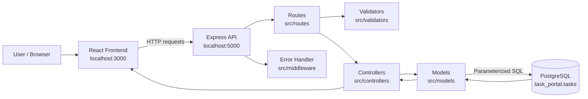

# Architecture Diagram



## Request Flow

```text
React UI
  -> Express route
  -> Request validation
  -> Controller
  -> Model
  -> PostgreSQL
  -> JSON response
  -> React UI update
```

## Main Folders

```text
client/      React frontend
src/         Node.js + Express backend
database/    PostgreSQL schema
postman/     API collection
```

## Backend Layers

```text
routes       API endpoints
validators   Request validation
controllers  Request and response logic
models       Database queries
middleware   Error handling and async handling
config       Database connection
```
